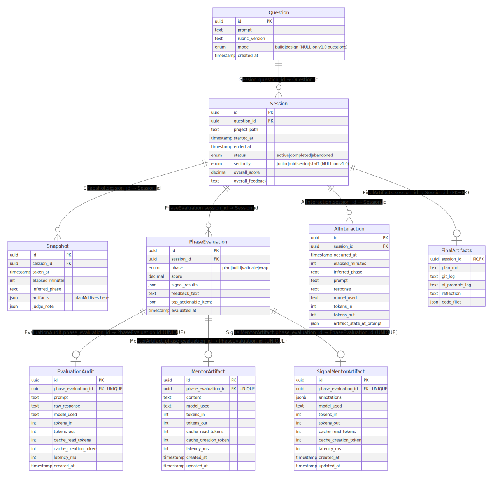
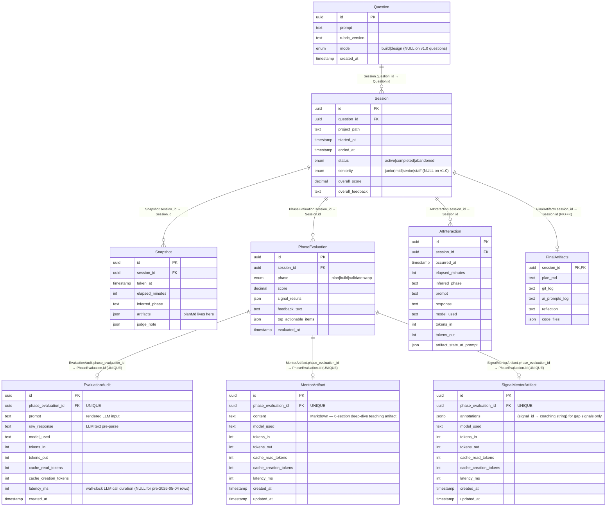

# Schema relationship diagram

Reference for the data model defined in `schema.prisma`. Update this file
when adding/removing tables or changing cardinalities. The diagram below
is the rendered SVG export of the Mermaid source that follows it — keep
the two in sync when you edit the schema.

## ER diagram

Mermaid source (click to expand)

## Relationships

Each row reads "child.foreign_key → parent.primary_key" — that's the column
linkage Postgres uses to enforce the relationship.

| Edge | Cardinality | Join (child FK → parent PK) | onDelete | Why |
| --- | --- | --- | --- | --- |
| Question → Session | 1 : N | `sessions.question_id` → `questions.id` | `Restrict` | Don't lose attempts; deleting a Question requires explicit cleanup of its sessions first. |
| Session → Snapshot | 1 : N | `snapshots.session_id` → `sessions.id` | `Cascade` | Snapshots are session-scoped logs. |
| Session → PhaseEvaluation | 1 : N | `phase_evaluations.session_id` → `sessions.id` | `Cascade` | Re-evaluate creates a new row; history retained per session. |
| Session → AIInteraction | 1 : N | `ai_interactions.session_id` → `sessions.id` | `Cascade` | Hint chat log. |
| Session → FinalArtifacts | 1 : 0..1 | `final_artifacts.session_id` → `sessions.id` (also PK on the child, which enforces 0..1) | `Cascade` | Optional snapshot of the session's final output (one per session). |
| PhaseEvaluation → EvaluationAudit | 1 : 0..1 | `evaluation_audits.phase_evaluation_id` → `phase_evaluations.id` (UNIQUE on child, which enforces 0..1) | `Cascade` | One audit per evaluation. Deleting an evaluation drops its audit. |
| PhaseEvaluation → MentorArtifact | 1 : 0..1 | `mentor_artifacts.phase_evaluation_id` → `phase_evaluations.id` (UNIQUE on child) | `Cascade` | Optional 6-section mentor reflection per evaluation. Fired in the background after eval persists. |
| PhaseEvaluation → SignalMentorArtifact | 1 : 0..1 | `signal_mentor_artifacts.phase_evaluation_id` → `phase_evaluations.id` (UNIQUE on child) | `Cascade` | Optional per-signal coaching map — `{signal_id → annotation}` populated only for gap signals (missed-good, fired-bad). Fired in the background after eval persists. |

## Design highlights

- **Question vs Session split**: Question = the problem
  (prompt + rubric version), Session = one attempt. A Question owns N
  attempts; the most recent `plan.md` is copied forward into a new attempt
  via the "Try again" path.
- **EvaluationAudit is a sibling, not a parent**, of `PhaseEvaluation`:
  parsed output (score, signals, feedback) stays lean on the main table;
  the heavy prompt/raw-response text lives only in the audit table. Cascade
  keeps them aligned without bloating the hot path.
- **No upsert on PhaseEvaluation.** Each Re-evaluate inserts a new row.
  The `(session_id, phase, evaluated_at DESC)` index makes "latest plan
  eval for session X" a single seek; nothing is ever overwritten.
- **JSON columns vs relational rows.** `signal_results` and `artifacts` are
  JSON because their shape is rubric-driven and varies across versions.
  Anything queried directly (status, scores, foreign keys) is a typed
  column.
